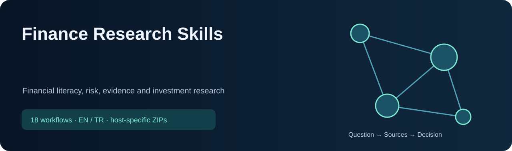

<!-- CURRENT-SKILL-PUBLICATION -->

# Finance Research Skills

18 skill: kaynak araştırma, araç seçimi ve doğrulanabilir sonuç üretme için hazır iş akışları. Modelin ağırlıklarını değiştirmez; sonuç kalitesi kullanılan kaynaklara ve araçlara bağlıdır.

 

**ChatGPT:** bütün listelenen skilleri içeren eklenti paketini indir; hesabının desteklediği kişisel eklenti/skill içe aktarma akışını kullan. Tek-skill ChatGPT bağlantısı, tek skill içeren eklenti ZIP’idir. **Claude:** toplu ZIP’i aç, içindeki tekil skill ZIP’lerini ayrı ayrı yükle. Dış ZIP tek bir Claude skill’i değildir. Yerel kurulum bulut hesabına yükleme yapmaz.

Türkçe veya İngilizce doğal isteklerle kullan; aşağıdaki örnekleri kendi soruna uyarla. Kısa kelimeler seçim ipuçlarıdır; bütün platformlarda aynı slash menüsünü oluşturmaz. Mevcut iş akışları ve güvenlik kuralları korunmuştur.

## Skill listesi

| Skill | Çözdüğü sorun / örnek istek | ChatGPT | Claude |
|---|---|---|---|
| [`crypto-research-readonly`](skills/common/crypto-research-readonly/SKILL.md) | Research crypto assets in a strictly read-only mode using verified network and contract identity, multi-venue price checks, liquidity and derivatives structure, tokenomics and unlocks, treasury and governance, protocol usage, on-chain evidence, smart-contract and custody risks, catalysts, technical context, and bear/base/bull scenarios. Use when the user asks which coin or token to buy, whether to hold or sell crypto, how much it may move, compares exchanges or tokens, or requests crypto market analysis. Never connect a wallet, sign a transaction, trade, transfer, bridge, approve a token, reveal a private key, or automate spending. Turkish triggers: kripto analizi, coin/token alınır mı, kontrat ve tokenomik, cüzdansız salt okunur araştırma. | [↓ ZIP](packages/chatgpt/crypto-research-readonly.zip) | [↓ ZIP](packages/claude/crypto-research-readonly.zip) |
| [`equity-opportunity-funnel`](skills/common/equity-opportunity-funnel/SKILL.md) | Search a broad investable stock universe and progressively narrow it into recommendation-grade equity ideas. Use when the user asks which stock to buy, the best or highest-upside stock, stock alternatives, a BIST or global stock scan, many shares to compare, or wants a prior stock recommendation rechecked before acting. Automatically deepen a simple “hisse öner” request through universe construction, multi-factor screening, medium diligence, full fundamental/valuation/technical/catalyst analysis, probabilistic forecasting, independent red-team review, failed-candidate replacement, and recommendation consistency tracking. Do not use for a purely descriptive company summary or when the user names a non-equity instrument. | [↓ ZIP](packages/chatgpt/equity-opportunity-funnel.zip) | [↓ ZIP](packages/claude/equity-opportunity-funnel.zip) |
| [`finance-evidence-guard`](skills/common/finance-evidence-guard/SKILL.md) | Automatically verify financial evidence whenever an answer uses a current price/quote, NAV, filing, fund holding, product term, fee, tax/legal rule, target, catalyst, macro release, analyst estimate, or the user asks “fiyat doğru mu”, “veri eski mi”, “kaynak uydurma mı”, “emin misin”. Resolve identity, source hierarchy, timestamps, units, currencies, calculations, staleness, conflicts, adjustment basis, and unsupported claims; run alongside equity, fund/ETF, warrant, technical, crypto, forecast, regime, portfolio, pre-trade, or thesis work. Treat interested financial content as claims, not proof. Do not replace the underlying analysis. | [↓ ZIP](packages/chatgpt/finance-evidence-guard.zip) | [↓ ZIP](packages/claude/finance-evidence-guard.zip) |
| [`financial-literacy-coach`](skills/common/financial-literacy-coach/SKILL.md) | Teach practical financial literacy with transparent calculations and adaptive explanations across budgeting, emergency funds, debt/credit, interest, inflation, compounding, fees, taxes, diversification, risk/return, funds/ETFs, stocks, bonds, derivatives, pensions, insurance, scams, and decision hygiene. Use for “explain finance”, money calculations, learning plans, or Turkish intents such as “finansal okuryazarlık”, “faiz/enflasyon hesabı”, “bileşik getiri”, “fon-hisse-varant farkı”, “kredi maliyeti”, “bütçe yap”, “yatırımı bana öğret”. Verify current local rules; do not turn education into a guaranteed product recommendation. | [↓ ZIP](packages/chatgpt/financial-literacy-coach.zip) | [↓ ZIP](packages/claude/financial-literacy-coach.zip) |
| [`fund-etf-analyst`](skills/common/fund-etf-analyst/SKILL.md) | Analyze and compare mutual funds, ETFs, index funds, money-market funds, pension funds, and TEFAS products using exact identity, mandate, benchmark, holdings, look-through overlap, fees/tax, NAV versus market price, liquidity, drawdown, factor exposures, and category-consistent alternatives. Use for fund/ETF buy-hold-sell decisions, portfolio fund selection, “best fund” or “which fund” requests, and Turkish intents such as “fon alınır mı”, “hangi fon daha iyi”, “TEFAS fon karşılaştır”, “ETF mi fon mu”, “fon dağılımı” and “fonu satayım mı”. Do not rank by trailing return alone or treat a fund code as verified identity. | [↓ ZIP](packages/chatgpt/fund-etf-analyst.zip) | [↓ ZIP](packages/claude/fund-etf-analyst.zip) |
| [`investment-copilot`](skills/common/investment-copilot/SKILL.md) | Orchestrate evidence-based investment research and decisions across equities, funds/ETFs, BIST/TEFAS, macro regimes, technicals, crypto, futures, warrants, portfolios, sizing, pre-trade checks, thesis tracking, journals, and short- or long-horizon forecasts. Use for buy/hold/add/reduce/sell/compare, “what should I buy”, highest-upside, position-size, reconsideration, or Turkish intents such as “alınır mı”, “ne alayım”, “en çok ne artar”, “sat/tut/artır/azalt”, “ne kadar yükselir/düşer”, “kaç lot/adet”, “portföyümü analiz et”, and “emin misin”. Verify current evidence, quantify ranges, challenge the leader, and give a clear conditional action without guaranteed-return language. Never trade autonomously or handle credentials. | [↓ ZIP](packages/chatgpt/investment-copilot.zip) | [↓ ZIP](packages/claude/investment-copilot.zip) |
| [`investment-journal-review`](skills/common/investment-journal-review/SKILL.md) | Review one completed investment/trade or a journal of many decisions while preserving the original plan, separating process quality from profit/loss, testing thesis and forecast accuracy, identifying repeated evidence/sizing/execution errors, and proposing one or two measurable improvements. Use for post-trade reviews, recommendation scorecards, “why did this lose”, “what am I doing wrong”, and Turkish intents such as “işlem günlüğümü analiz et”, “işlem sonrası analiz”, “tahminlerin ne kadar tuttu”, “zararımdan ders çıkar”, “geçmiş al-satları incele”. Do not rewrite the original plan with hindsight or infer a stable edge from a small sample. | [↓ ZIP](packages/chatgpt/investment-journal-review.zip) | [↓ ZIP](packages/claude/investment-journal-review.zip) |
| [`investment-red-team`](skills/common/investment-red-team/SKILL.md) | Independently challenge and audit an investment recommendation, thesis, valuation, portfolio action, technical setup, fund comparison, crypto analysis, or leveraged-product scenario. Use when the user asks "emin misin?", requests a fresh analysis or second opinion, asks whether a better stock, fund, ETF, gold, crypto, cash, or other relevant alternative exists, is considering a concentrated or high-risk trade, or another finance skill delegates final review. Re-underwrite without anchoring to the prior pick, recompute key numbers, seek disconfirming evidence, compare same-asset and relevant cross-asset challengers plus doing nothing, and return an evidence-based verdict. Do not merely defend, restate, or self-score the original analysis, and do not force a different answer just to appear independent. Turkish triggers: yatırım fikrini yeniden sorgula, emin misin, karşı tez ve alternatifler, bağımsız ikinci görüş. | [↓ ZIP](packages/chatgpt/investment-red-team.zip) | [↓ ZIP](packages/claude/investment-red-team.zip) |
| [`investment-thesis-tracker`](skills/common/investment-thesis-tracker/SKILL.md) | Create and maintain an append-only investment thesis with original evidence cutoff, what is priced in, falsifiable pillars, KPIs, catalysts, valuation and entry gates, risks, kill/add/trim/exit criteria, review dates, and evidence-delta updates. Use to monitor a holding or prior recommendation, prepare earnings reviews, or for Turkish intents such as “yatırım tezimi kaydet/takip et”, “bu hisseyi bundan sonra izle”, “tez bozuldu mu”, “hangi şartta artır/sat”, “önceki analizle ne değişti”. Separate company quality, security readiness, and portfolio action; never rewrite the original thesis with hindsight. | [↓ ZIP](packages/chatgpt/investment-thesis-tracker.zip) | [↓ ZIP](packages/claude/investment-thesis-tracker.zip) |
| [`market-regime-analysis`](skills/common/market-regime-analysis/SKILL.md) | Classify and explain the current market regime across trend, volatility, breadth, liquidity, rates, inflation, FX, credit, earnings revisions, positioning, correlations, and dated policy/event risk, then map it to asset and strategy sensitivities. Use for macro allocation, risk-on/risk-off, timing context, cross-asset comparisons, or Turkish intents such as “piyasa rejimi”, “risk-on risk-off”, “şu an hangi varlık avantajlı”, “faiz-enflasyon-borsa ilişkisi”, “volatilite ve genişlik”, “makro ortamı analiz et”. A regime label is context, not a standalone buy/sell signal or deterministic forecast. | [↓ ZIP](packages/chatgpt/market-regime-analysis.zip) | [↓ ZIP](packages/claude/market-regime-analysis.zip) |
| [`portfolio-risk-and-sizing`](skills/common/portfolio-risk-and-sizing/SKILL.md) | Analyze portfolio concentration, position size, issuer/fund look-through overlap, sector/country/currency/rate/factor exposure, liquidity, leverage, correlation fragility, scenario loss, drawdown budget, and add-trim-hedge constraints. Use for portfolio reviews, allocation and rebalancing, “how much should I buy”, concentration or diversification questions, and Turkish intents such as “portföyümü analiz et”, “kaç lot/adet”, “yüzde kaç ayırayım”, “risk dağılımı”, “çok mu yoğunlaştım”, “fonlar çakışıyor mu”. Do not optimize from unstable estimates by default or claim diversification from the number of tickers alone. | [↓ ZIP](packages/chatgpt/portfolio-risk-and-sizing.zip) | [↓ ZIP](packages/claude/portfolio-risk-and-sizing.zip) |
| [`pre-trade-investment-gate`](skills/common/pre-trade-investment-gate/SKILL.md) | Run a final read-only readiness check before an investment or trade across exact identity, evidence cutoff, executable entry, thesis, payoff, catalysts, invalidation, quantity, maximum loss, portfolio fit, liquidity, spread/fees/tax, settlement, expiry/margin, operational risk, and independent challenge. Use when the user is about to act, asks “should I place it now”, “final check”, “is this trade ready”, or Turkish intents such as “son kontrol”, “emri vereyim mi”, “işleme gireyim mi”, “alım için hazır mı”, “bir kez daha kontrol et”. Return READY/CONDITIONAL/NOT READY/REJECT, but never place, transmit, or automate an order. | [↓ ZIP](packages/chatgpt/pre-trade-investment-gate.zip) | [↓ ZIP](packages/claude/pre-trade-investment-gate.zip) |
| [`probabilistic-market-forecast`](skills/common/probabilistic-market-forecast/SKILL.md) | Estimate realistic price/return distributions, target and downside probabilities, and probability-weighted scenarios for stocks, funds/ETFs, futures, warrants, crypto, commodities, FX, and portfolios; freeze and score forecasts after maturity. Use for how much/when an instrument may rise or fall, highest realistic upside, target odds, or Turkish intents such as ‘ne kadar yükselir/düşer’, ‘kaç günde/ayda’, ‘en çok ne artar’, ‘hedefe ulaşma ihtimali’, ‘ayı-baz-boğa’, ‘olasılıklı fiyat tahmini’, and ‘tahminlerin ne kadar tuttu’. Compare against naive/market benchmarks and calibration; never claim single-point certainty or guaranteed accuracy. | [↓ ZIP](packages/chatgpt/probabilistic-market-forecast.zip) | [↓ ZIP](packages/claude/probabilistic-market-forecast.zip) |
| [`public-equity-research`](skills/common/public-equity-research/SKILL.md) | Perform recommendation-grade research on a named listed company using exact security identity, point-in-time primary filings, business/segment economics, earnings quality, balance sheet, cash flow, dilution, management/governance, industry/competition, valuation, what is priced in, catalysts, revisions, risks, and falsifiable thesis criteria. Use for company/hisse fundamental analysis, earnings and valuation, or Turkish intents such as “şirketi/hisseyi derin analiz et”, “bilanço ve değerleme”, “adil değer”, “yatırım tezi”, “KAP/10-K sonuçları”, “bu hisse neden alınır/satılır”. For open-ended “which stock” requests, route through the broad equity funnel first; never infer a market-wide winner from one company analysis. | [↓ ZIP](packages/chatgpt/public-equity-research.zip) | [↓ ZIP](packages/claude/public-equity-research.zip) |
| [`technical-quant-analysis`](skills/common/technical-quant-analysis/SKILL.md) | Perform evidence-based technical and quantitative analysis from verified OHLCV data, including trend, momentum, volatility, volume, support/resistance, multi-timeframe structure, scenario levels, position risk, strategy testing, and backtest quality control. Use when the user asks for chart analysis, RSI/MACD/ATR, entry or exit timing, short-term price scenarios, stop/invalidation levels, technical screening, or whether a signal historically worked. Do not use technical indicators alone to claim certainty or replace fundamental, event, liquidity, and product-risk analysis. Turkish triggers: teknik ve nicel piyasa analizi, grafik/destek-direnç, OHLCV ve backtest. | [↓ ZIP](packages/chatgpt/technical-quant-analysis.zip) | [↓ ZIP](packages/claude/technical-quant-analysis.zip) |
| [`turkey-markets-analysis`](skills/common/turkey-markets-analysis/SKILL.md) | Analyze Turkish financial markets using BIST, KAP, TEFAS, TCMB EVDS, TÜİK, SPK, issuer/fund/product documents, and current Türkiye-specific rules. Use for BIST equities, Turkish ETFs/certificates, TEFAS funds, TRY/FX macro effects, inflation accounting, corporate actions, VİOP, warrants, broker/bank products, or Turkish intents such as “BIST hissesi”, “TEFAS fon”, “varant/VİOP”, “TCMB faiz”, “KAP bilanço”, “TMS 29”. Apply universal fund, warrant, forecast, technical and portfolio specialists where appropriate; own Türkiye sourcing and market mechanics. Do not use for non-Turkish markets except comparison. | [↓ ZIP](packages/chatgpt/turkey-markets-analysis.zip) | [↓ ZIP](packages/claude/turkey-markets-analysis.zip) |
| [`warrant-structured-product-analyst`](skills/common/warrant-structured-product-analyst/SKILL.md) | Analyze listed warrants, certificates, turbos, and related structured products from the official product terms, executable quote, underlying distribution, strike/barrier, expiry, conversion convention, settlement, market maker, spread, liquidity, time decay, implied volatility, Greeks, effective gearing, break-even, and total-loss scenarios. Use for “which warrant”, warrant quantity/return/risk, call-put comparisons, or Turkish intents such as “varant alınır mı”, “hangi varant”, “varant kaç adet”, “dayanak yüzde 10 artarsa varant ne olur”, “kullanım fiyatı/vade/dönüşüm oranı”. Never infer a fixed return from the underlying move or treat indicative model value as an issuer quote. | [↓ ZIP](packages/chatgpt/warrant-structured-product-analyst.zip) | [↓ ZIP](packages/claude/warrant-structured-product-analyst.zip) |
| [`yigit-investment-copilot`](skills/common/yigit-investment-copilot/SKILL.md) | Borsa/fon araştır; portföy riskini değerlendir; emir göndermez | [↓ ZIP](packages/chatgpt/yigit-investment-copilot.zip) | [↓ ZIP](packages/claude/yigit-investment-copilot.zip) |

## Teknik bilgiler

Claude açıklamaları en fazla 200 karakterdir; her skill paketi en fazla 200 dosya içerir. Kaynaklar, yardımcı betikler ve lisanslar paketlenir. API anahtarları, ücretli erişim, yerel CLI ve canlı veri bağlantıları paketin parçası değildir. Kontroller paket yapısını ve kaynak eşleşmesini doğrular; hesapta yükleme, klinik doğruluk veya yatırım performansı testi yapıldığı anlamına gelmez. [Bütünlük değerleri](downloads/SHA256SUMS.txt) · [Kaynak ve lisans bilgisi](THIRD_PARTY_NOTICES.md).

Research and education only: no autonomous orders, credential handling or return guarantees. / Araştırma ve eğitim; otomatik emir göndermez, getiri garanti etmez.

<!-- END-CURRENT-SKILL-PUBLICATION -->

# Universal AI Finance Skills — Türkçe

> **Yeni — 2. sürüm:** canlı BIST veri motoru, yatırım komitesi ve işlem planı içeren tek yönlendirmeli copilot artık [yigit-investment-copilot](https://github.com/yigityildiz0/yigit-investment-copilot) deposunda. Bu depo v1 (17 ayrı skill) olarak erişilebilir kalır.

Türkçe açıklama ve kullanım akışı için [README.md içindeki Türkçe bölüme](README.md#türkçe) bakın.

Bu paket yatırım getirisi garantisi vermez ve otomatik işlem yapmaz.
